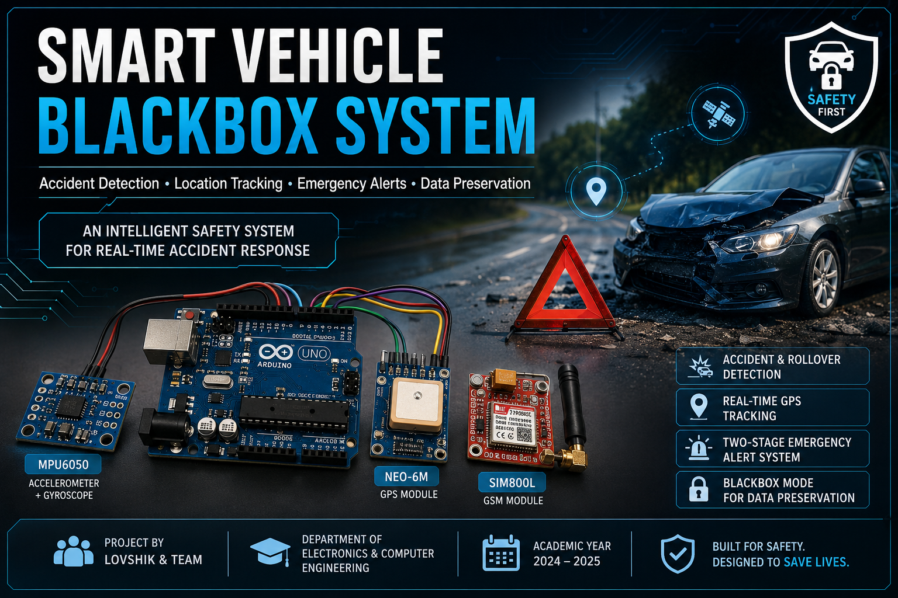
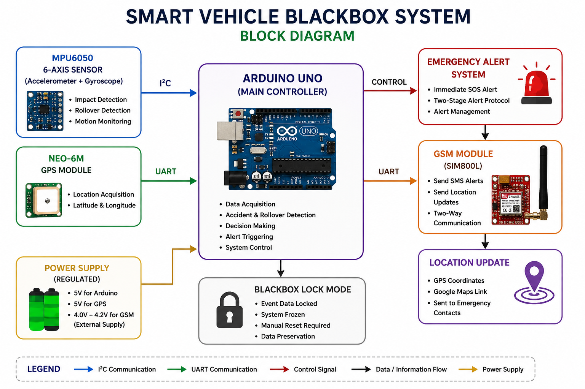
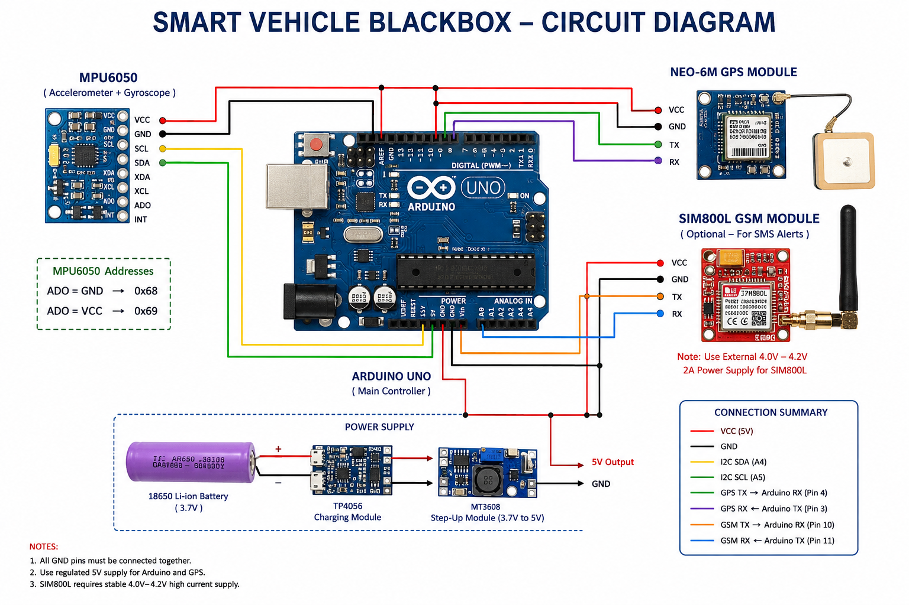
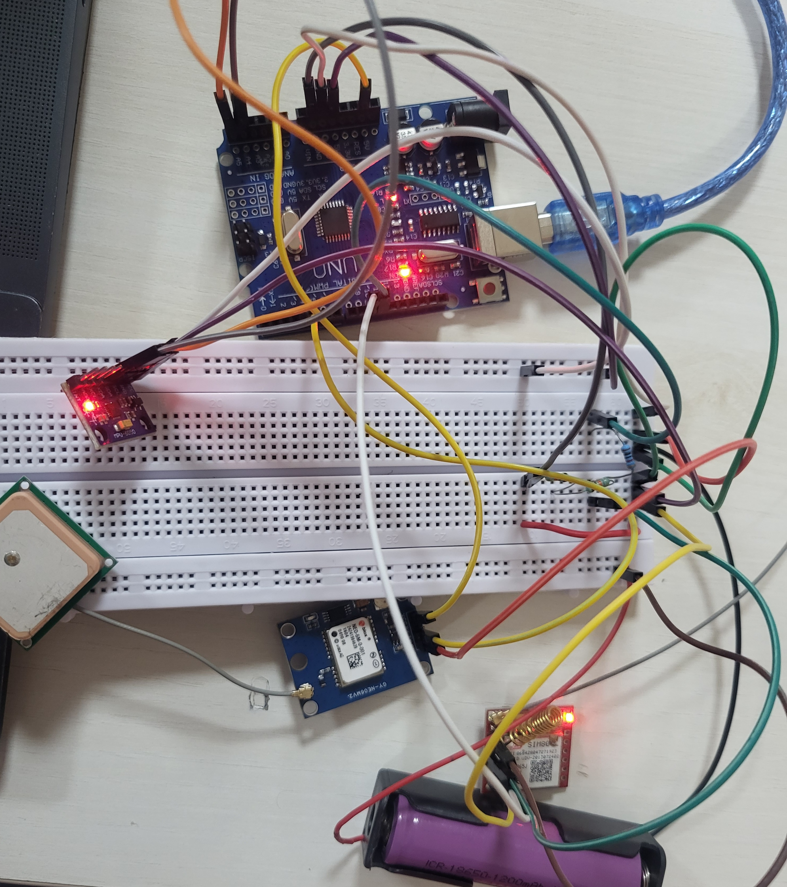
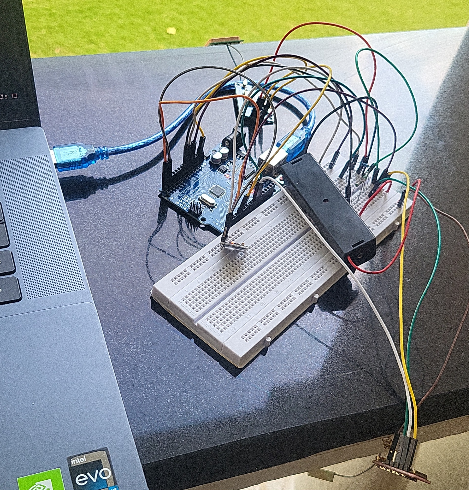

# Smart Vehicle Blackbox with Accident Detection and Emergency Response System

<p align="center">
  
</p>

## Overview

The Smart Vehicle Blackbox System is an intelligent automotive safety solution designed to detect vehicle accidents, identify rollover events, acquire GPS coordinates, and generate emergency alerts automatically.

Inspired by aircraft blackboxes, the system continuously monitors vehicle motion using an MPU6050 sensor and provides location-aware emergency response support through GPS tracking. Following an accident, the system preserves event information by entering a protected lock state until manually reset.

This project demonstrates a low-cost and scalable approach toward intelligent vehicle safety systems.

---

## Problem Statement

Road accidents often lead to delayed emergency response because:

- Victims may be unable to call for help.
- Accident locations may not be immediately known.
- Emergency contacts are not informed quickly.
- Important accident information is lost.

The objective of this project is to automate accident detection and emergency reporting while preserving critical event information.

---

## Features

### Accident Detection

Detects sudden impacts using MPU6050 accelerometer data.

### Rollover Detection

Identifies abnormal vehicle orientation and rollover conditions.

### GPS Location Tracking

Obtains real-time vehicle coordinates using the NEO-6M GPS module.

### Two-Stage Emergency Alert Protocol

#### Stage 1 – Immediate Alert

Emergency notification is triggered immediately after accident detection.

```text
ACCIDENT DETECTED
SOS Triggered
GPS Acquiring...
```

#### Stage 2 – Location Update

Location information is transmitted after GPS lock is acquired.

```text
LOCATION UPDATE
Latitude: xx.xxxxxx
Longitude: xx.xxxxxx
```

### Blackbox Lock Mode

After accident detection:

- Event information is preserved.
- Multiple alerts are prevented.
- Manual reset is required.

---

## System Architecture

```text
           MPU6050
    (Impact + Rollover)
               |
               v
        +-------------+
        | Arduino UNO |
        +------+------+ 
               |
      +--------+--------+
      |                 |
      v                 v

   NEO-6M         Emergency Logic
     GPS
      |
      v
 Location Update
      |
      v
 Emergency Alert
      |
      v
 Blackbox Lock Mode
```

---

## Hardware Components

| Component | Quantity |
|-----------|----------|
| Arduino UNO | 1 |
| MPU6050 | 1 |
| NEO-6M GPS Module | 1 |
| Breadboard | 1 |
| Jumper Wires | Multiple |
| Power Supply | 1 |

---

## Circuit Connections

### MPU6050

| MPU6050 | Arduino UNO |
|----------|------------|
| VCC | 5V |
| GND | GND |
| SDA | A4 |
| SCL | A5 |

### NEO-6M GPS Module

| GPS Module | Arduino UNO |
|------------|------------|
| VCC | 5V |
| GND | GND |
| TX | D4 |
| RX | D3 |

---

## Working Principle

### Step 1 – Continuous Monitoring

The MPU6050 continuously measures:

- X-axis acceleration
- Y-axis acceleration
- Z-axis acceleration

### Step 2 – Accident Detection

Acceleration magnitude is calculated using:

```text
A = √(Ax² + Ay² + Az²)
```

Thresholds used:

```text
Magnitude > 25000

OR

|Ax| > 18000

OR

|Ay| > 18000
```

### Step 3 – Emergency Alert

When an accident is detected, an emergency alert is generated immediately.

### Step 4 – GPS Location Acquisition

The system waits for GPS lock and retrieves:

- Latitude
- Longitude

Example:

```text
17.568181,78.431915
```

Generated Maps Link:

```text
https://maps.google.com/?q=17.568181,78.431915
```

### Step 5 – Blackbox Lock

After event logging:

```text
Blackbox Event Logged
System Locked
Manual Reset Required
```

The system remains halted until reset.

---

## Sample Output

```text
MPU6050 Connected

Smart Vehicle Blackbox Ready

GPS: 17.568181,78.431915

Magnitude: 17420

***** ACCIDENT DETECTED *****

EMERGENCY ALERT SENT

SOS Sent To Emergency Contact

GPS Acquiring...

LOCATION UPDATE SENT

Coordinates:
17.568181,78.431915

Google Maps Link:
https://maps.google.com/?q=17.568181,78.431915

Blackbox Event Logged

System Locked
Manual Reset Required
```

---

## Repository Structure

```text
Smart-Vehicle-Blackbox/
│
├── README.md
│
├── code/
│   └── SmartVehicleBlackbox.ino
│
├── images/
│   ├── cover.png
│   ├── block_diagram.png
│   ├── circuit_diagram.png
│   └── prototype.jpg
│
├── docs/
│   └── Project_Report.pdf
│
└── hardware/
    └── component_list.txt
```

---

## Project Images

### Cover


### Block Diagram



### Circuit Diagram



### Prototype




---

## Applications

- Personal Vehicles
- Commercial Fleets
- Emergency Response Systems
- Public Transportation Monitoring
- Insurance Investigation
- Smart Mobility Platforms

---

## Future Enhancements

### GSM Integration

Send real SMS alerts using SIM800L.

### SD Card Logging

Store sensor readings and accident information.

### Cloud Connectivity

Provide real-time monitoring through IoT dashboards.

### Fire Detection

Integrate temperature and smoke sensing modules.

### Machine Learning

Improve accident classification and reduce false alarms.

---

## Key Highlights

- Accident Detection
- Rollover Detection
- GPS Location Tracking
- Emergency Alert Generation
- Two-Stage Notification Protocol
- Blackbox Event Preservation
- Low-Cost Hardware Implementation

---

## Authors

- Jahnavi
- Deekshita
- Charitha
- Alisha
- Lovshik

---

## License

This project is intended for educational and research purposes.
